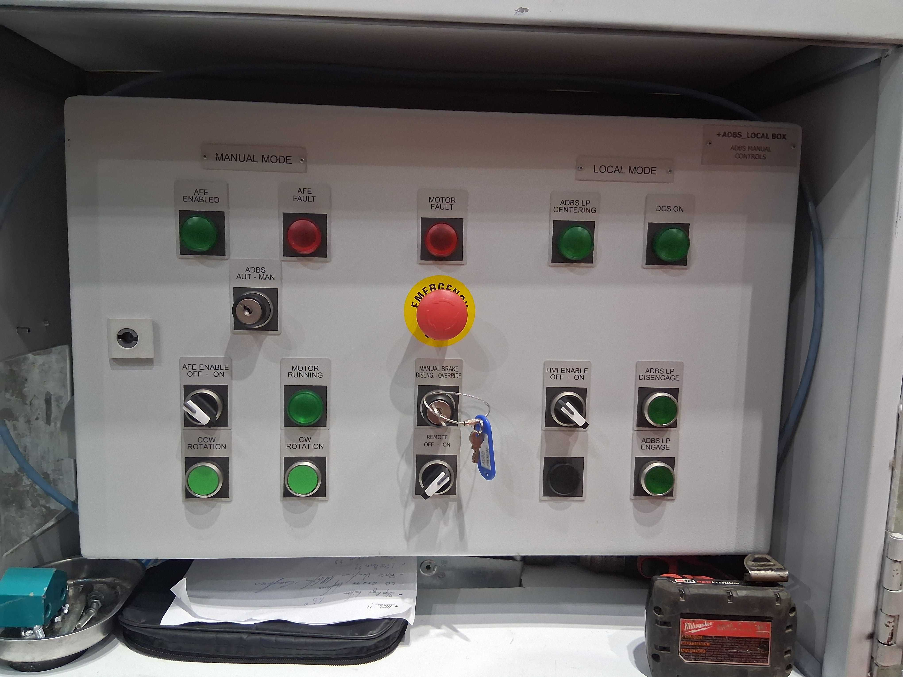

.. _Error_Handling:

################
Error Handling
################

This document details the error handling in the main telescope dome control system.

.. _Exit_Fault:

Exit Fault
==========

The main telescope dome control system is a state-machine-based application that contains multiple independent subsystems.
Each subsystem has its own state machine.
When there is an error in a subsystem, the error is reported and shows in the related table.
You can exit the fault for each subsystem from the command panel.

For example, the following image shows the current fault in the aperature shutter:

.. figure:: ../screenshot/error.png
  :width: 550

  Error in the aperture shutter control system.

The error message shows the emergency pushbotton is pressed.
After you release it, you can issue the "Exit fault" command to re-enable the subsystem.
If the GUI is not the current commander, you might need to check with the :ref:`Hardware_Selector`.

.. _Hardware_Selector:

Hardware Selector
=================

There are three TCP/IP clients (GUI, CSC, and Keba/HMI) can be the commander of dome control system, which is decided by the hardware selector:

  Control cabinet on level 7.

If the **REMOTE** knob is **ON** (see the middle bottom), the commander is the CSC.
Otherwise, it is the GUI or Keba/HMI, which is decided by the **HMI ENABLE** knob (see the right bottom).
If the **HMI ENABLE** knob is **ON**, the commander is the Keba/HMI; otherwise, it is the GUI.
