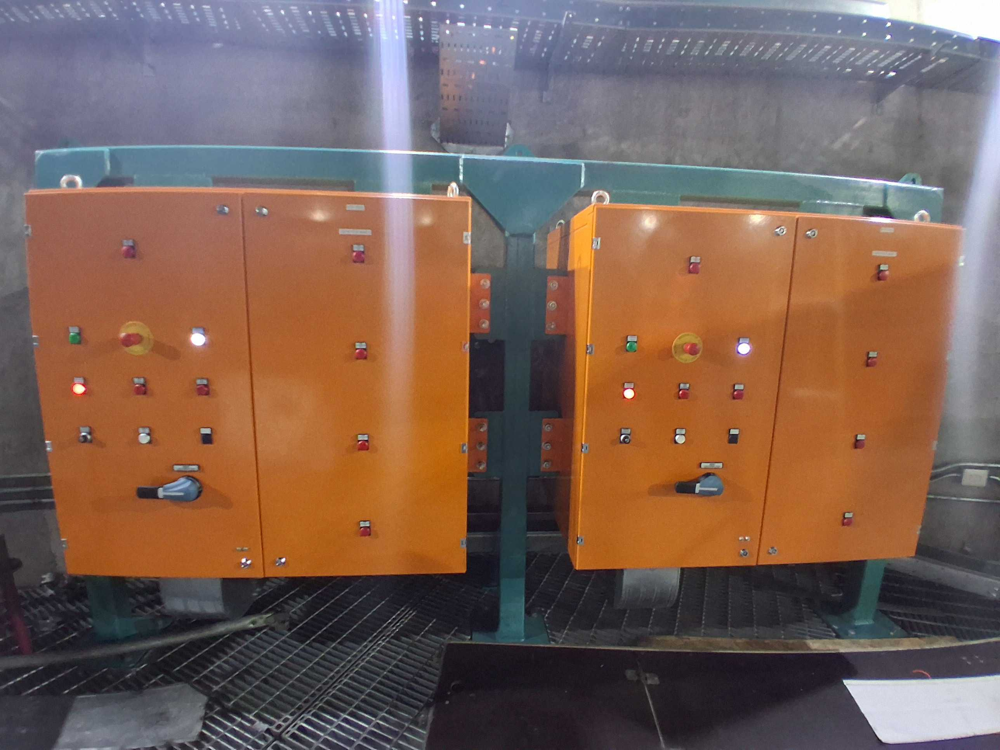
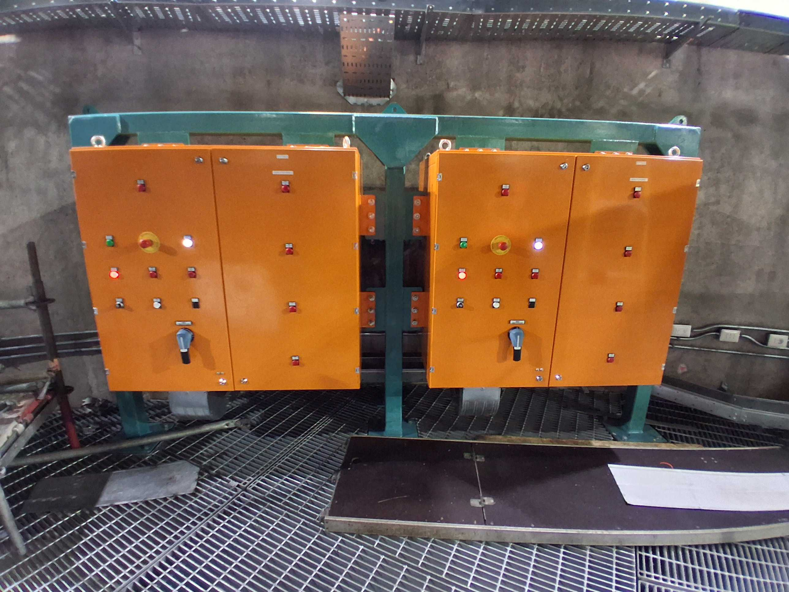

.. _Capacitor_Bank:

################
Capacitor Bank
################

The capacitor bank provides the power to the dome motors to be able to reach the full performance.
If it is not connected or has an issue, the dome will only have the degraded performance.

.. _Capacitor_Bank_Status:

Capacitor Bank Status
=====================

The capacitor banks are on the level 6 interior pier.
The following figure is that they are on and charged:

  Capacitor banks are on and charged.

The lever at the bottom left is used to control the on/off.
If they are off and charged, it would be:

  Capacitor banks are off and charged.

If they are discharged, you will see the red light on the middle left off and green light on the top left on.
