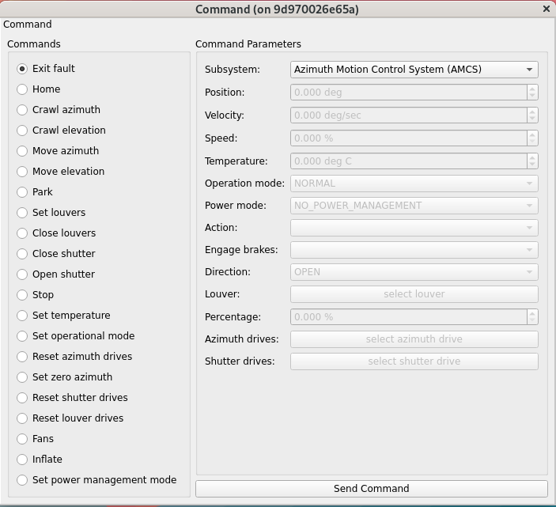
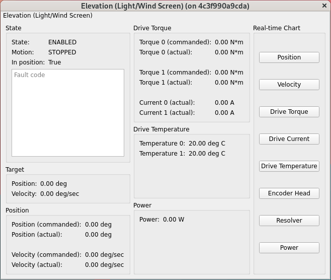
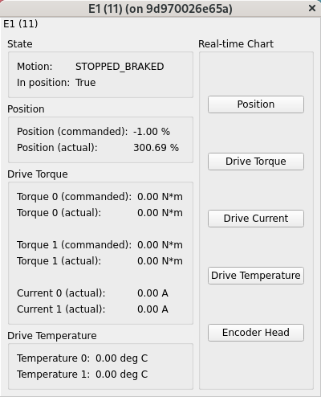
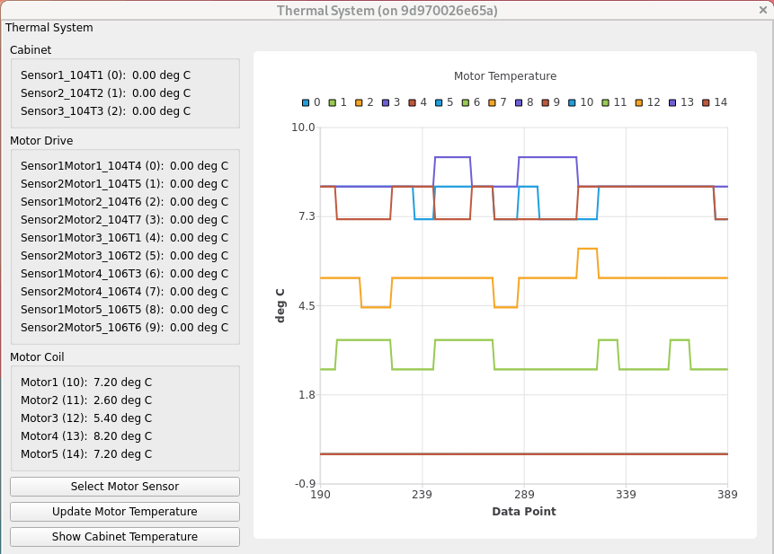
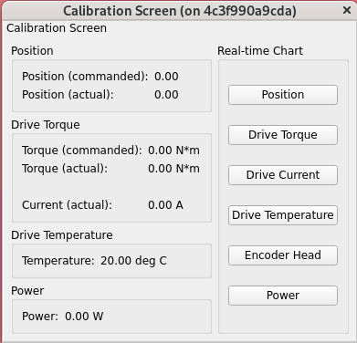

.. _User_Guide:

################
User Guide
################

This graphical user interface (GUI) is a Qt-based application to control the azimuth, elevation, aperture shutter, and other subsystems, show the configurable parameter settings of the dome control system, reset errors, and diagnose issues observed during the operation.
This GUI is supposed to be used by the hardware engineers or operators to have a more detailed control of hardware compared with the automatic or remote mode (a.k.a. commandable SAL component, CSC): `ts_mtdome <https://ts-mtdome.lsst.io/>`_.
If the GUI can not reset the error or enable the system, the dome CSC will not be able to as well because they are using the same interface to the control system.
Functionality of the GUI will be discussed in detail to provide the reader a comprehensive source for understanding the operation of GUI.

.. _Operation:

Operation
============

Use the command line in terminal to run the GUI by ``run_mtdomegui``.
The simulation mode is provided to let you to be familiar with the application.
You can do the following to get more information of GUI.

.. code:: bash

    run_mtdomegui -h

By default, there will be a log file created under the ``/rubin/dome/log`` or ``$HOME`` directory to support the debug.
You can assign the `logging level <https://docs.python.org/3/library/logging.html#logging-levels>`_ from the command line or use the GUI (see :ref:`lsst.ts.mtdomegui-user_settings`).

The operation of GUI is explained below.
For each action (or click the button), you need to wait for some time to let the GUI finish the related command with the control system in the timeout period.

.. _lsst.ts.mtdomegui-user_control_panel:

Control Panel
-------------

.. figure:: ../screenshot/control_panel.png
  :width: 400

  Control panel of application

After the execution of GUI, you will see the above control panel.
You can use the top toolbar to change the **Settings** of GUI, **Connect**/**Disconnect** the dome controller, and **Exit** the application.

The top region of control panel shows the summary of the dome system.
You can see that whether the azimuth/elevation/shutter/louver/rear access door/calibration screen is in fault, interlock, locking pin, brake, power mode, and control mode status (remote, GUI, or others).

The bottom region of control panel has multiple tables that you can double-click to open to have more detailed system information.
If you move the mouse close to the buttons/indicators and texts in the panel and tables, you will see the prompted tips to explain the related details.

.. _lsst.ts.mtdomegui-user_settings:

Settings
--------

  Settings of application

You can modify the settings in application.
The default values come from the configuration file.
You can do the following things:

#. Update the host name, port, and connection timeout in TCP/IP connection.

#. General settings of application. You can use the different `logging level <https://docs.python.org/3/library/logging.html#logging-levels>`_ to support the debugging if needed. The log file will be in the ``/rubin/dome/log`` directory. If it does not exist in file system, the log file will be in the ``$HOME`` directory.

#. Settings of the azimuth motion control system (AMCS). You can modify the maximum jerk, acceleration, and velocity.

#. Settings of the elevation control system. You can modify the maximum jerk, acceleration, and velocity.

After the modification of settings, you can click the related **Apply** button to use the new values.
To reach the full performance of dome, you need to connect it with the :ref:`Capacitor_Bank`.

AMCS can apply the following settings in the full performance:

* Jmax = 3.0 deg/s3
* Amax = 0.85 deg/s2
* Vmax = 1.5 deg/s

Be aware that this configuration requires the capacitors banks to be switched on and connected to the DC bus.
If this is not the case, the active front end (AFE) will fail.
The system will go to the fault state because the voltage on the DC bus drops below a threshold set by Phase.
You will need to perform a ``resetDrivesAz()`` (and ``exitFaultAz()``) to restore the system.

In case the capacitor banks are not connected or are not switched on, you must use the following parameters instead:

* Jmax = 3.0 deg/s3
* Amax = 0.25 deg/s2
* Vmax = 1.0 deg/s

And the ``moveAz()`` command will not fail the AFE.
Be aware that the ``config()`` command is accepted only if the dome is in **STATIONARY** state (stopped with brakes engaged) or **PARKED** state.

.. _lsst.ts.mtdomegui-user_exit:

Exit
----

.. figure:: ../screenshot/exit.png
  :width: 350

  Exit the application

You can click the **Exit** button to leave the application, and a window will prompt out to confirm this action.
Before the exit, you need to disconnect the GUI from the controller first.

.. _lsst.ts.mtdomegui-user_command:

Command
-------

  Command.

You can use the command table to control the dome system.
It lists all the available commands at the moment.
Once a command is selected, the related parameters will be shown as well to let you change the values.

Some commands would need you to select the input clearly.
For example, you would need to decide you want to engage the brakes or not in the stopping:

  Stop command.

Some commands would need you to open the related selection widget to select the items.
For example, the command to reset the azimuth drives would need this:

  Reset azimuth drives command.

After selecting the command and changing the parameters, you can click the **Send Command** button to send the command to the control system.
You will need to be the current commander to control the dome.
See the :ref:`Hardware_Selector` for more information.

.. _lsst.ts.mtdomegui-user_utility:

Utility
-------

  Utility.

You can see the operational mode for each subsystem.
There are two modes: **NORMAL** and **DEGRADED**.
Take the azimuth motion control system as an example.
In the **NORMAL** mode, all 5 motors must be working, otherwise the system goes to fault.
Moreover, the **NORMAL** mode allows to go to full performance of the dome.
In the **DEGRADED** mode, the dome can rotate with 5 or 4 motors (if one of the 5 motors is in fault), but at reduced speed and acceleration.

In addition, there are the indicators of the capacity bank.
The green color means everything is fine, and the red color means there is an issue.
If you see any indicator to be red, you need to check the capacity bank to see what is going on.

You can base on the DC bus voltage to know the capacitor banks are connected or not.
If the voltage is lower than 25 V, you will see the "Low residual voltage" indicator to be red.
If the capacitor banks are connected and there is no issue, once the control system receives the ``moveAz()`` command, they will begin to charge until 690 V to do the movement.
Otherwise, you should see the voltage keeps low after issuing the ``moveAz()`` command.
Then, you know maybe they are not connected or something went wrong (such as the blowing fuses or others).
If the capacitor banks are not connected, the azimuth control system can only run the degraded mode.

.. _lsst.ts.mtdomegui-user_azimuth:

Azimuth
-------

  Azimuth motion control system.

You can see the status of azimuth motion control system in this table.
It shows the current state and motion state.
If there is the fault, you will see the error message in the table.
When the dome rotates, you will see the current target, position, velocity, torque, and motor current here.
You can click the buttons to see the realtime charts as well.
For example, the following chart shows the azimuth's position in realtime:

  Azimuth's position.

.. _lsst.ts.mtdomegui-user_elevation:

Elevation (Light and Wind Screen)
---------------------------------

  Elevation (light and wind screen) control system.

You can see the status of elevation control system in this table.
It shows the current state and motion state.
If there is the fault, you will see the error message in the table.
When the screen moves, you will see the current target, position, velocity, torque, motor current, drive temperature, and power here.
You can click the buttons to see the realtime charts as well.

.. _lsst.ts.mtdomegui-user_shutter:

Aperture Shutter
-----------------

  Aperture shutter control system.

You can see the status of aperture shutter control system in this table.
It shows the current state and motion state.
If there is the fault, you will see the error message in the table.
When the dome opens or closes the shutter, you will see the current position, torque, motor current, drive temperature, and power here.
You can click the buttons to see the realtime charts as well.

.. _lsst.ts.mtdomegui-user_louver:

Louver
------

  Louver control system.

You can see the status of louver control system in this table.
It shows the current state, error code, current power, and related realtime chart.
For each single available louver status, you can click the related button to get the detailed information as the following:

  Single louver status.

It provides the information of motion state, position, torque, motor current, and drive temperature.

.. _lsst.ts.mtdomegui-user_thermal:

Thermal
-------

  Thermal control system.

You can see the status of thermal control system in this table.
The left lists the temperatures of cabinet, motor drive, and motor coil.
The right shows the realtime chart.
You can select and update the individual motor sensor as the following:

  Selector of the sensors.

.. _lsst.ts.mtdomegui-user_rad:

Rear Access Door
----------------

  Rear access door control system.

You can see the status of rear access door control system in this table.
It shows the current state and motion state.
If there is the fault, you will see the error message in the table.
It also shows the current position, torque, motor current, drive temperature, and power here.
The related realtime charts are provided.
It also has the safety indicators to show the status of limit switches, locking pins, brakes, photo sensors, and light curtain.

.. _lsst.ts.mtdomegui-user_calibration:

Calibration Screen
------------------

  Calibration screen control system.

You can see the status of calibration screen control system in this table.
It shows the current state and motion state.
If there is the fault, you will see the error message in the table.
It also shows the current position, torque, motor current, drive temperature, and power here.
The related realtime charts are provided.
